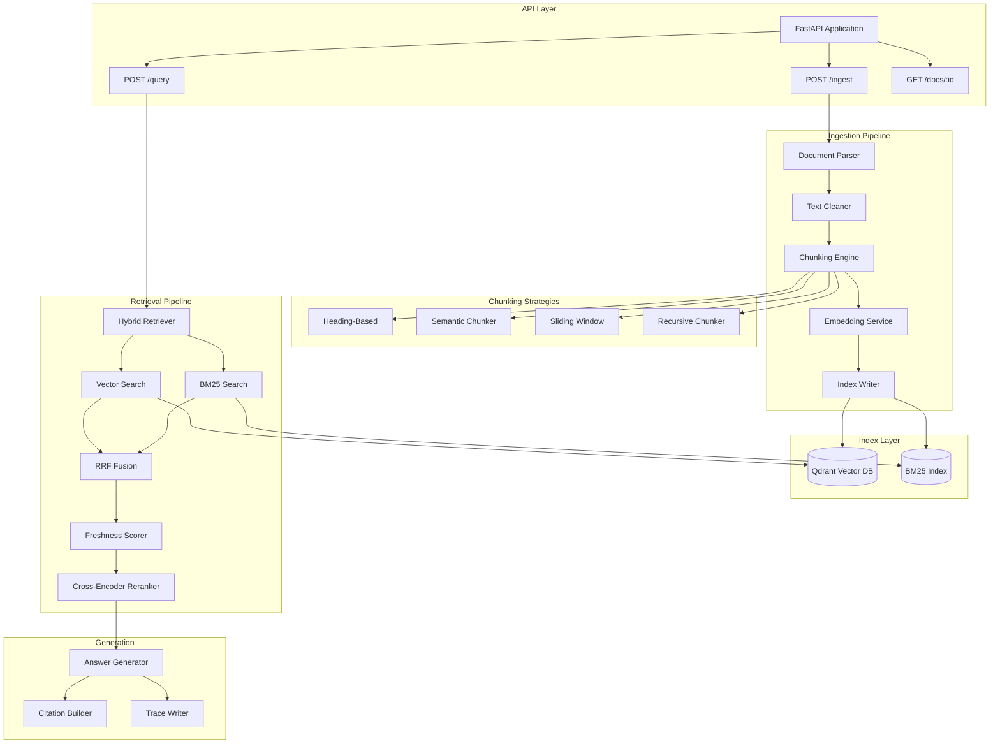

# RAG Platform

A production-quality Retrieval-Augmented Generation (RAG) platform that ingests documents, chunks them intelligently, embeds content, stores in a vector database, performs hybrid retrieval (BM25 + vector), reranks results, and generates answers with citations and freshness logic.

## Features

- **Multi-format Document Ingestion**: PDF, HTML, DOCX, Markdown, plain text
- **Multiple Chunking Strategies**: Recursive, sliding window, heading-based, semantic
- **Hybrid Retrieval**: Combines vector search (Qdrant) with lexical search (BM25)
- **Reciprocal Rank Fusion (RRF)**: Smart result combination from multiple retrievers
- **Freshness Boosting**: Exponential decay scoring for time-sensitive content
- **Cross-Encoder Reranking**: BGE-reranker-large for precise relevance ranking
- **Citation Extraction**: Automatic citation building with source attribution
- **Local-First Architecture**: Works offline with local models, enhanced by cloud APIs
- **Comprehensive Evaluation**: Recall@k, precision, MRR, NDCG, citation precision

## Architecture



## Tech Stack

| Component | Technology | Purpose |
|-----------|------------|---------|
| Runtime | Python 3.11+ | Modern async, type hints |
| API | FastAPI + Pydantic v2 | Type-safe REST API with OpenAPI |
| Vector DB | Qdrant (Docker) | Scalable vector storage with filtering |
| Lexical Search | rank-bm25 | Traditional keyword search |
| Embeddings | OpenAI text-embedding-3-small / sentence-transformers | Cloud + local embedding options |
| Reranker | BGE-reranker-large | Cross-encoder reranking |
| LLM | OpenAI / Anthropic / Ollama | Flexible generation with fallback |

## Quick Start

### Prerequisites

- Python 3.11+
- Docker (for Qdrant)
- OpenAI API key (optional, for cloud embeddings/generation)

### Setup

```bash
# Clone and setup
git clone <repo-url>
cd rag-platform
make setup

# Start Qdrant
make start-qdrant

# Copy and configure environment
cp .env.example .env
# Edit .env with your API keys

# Run the API
make run
```

### One-Command Setup

```bash
make all  # Installs deps, starts Qdrant, runs API
```

## API Documentation

### POST /ingest

Ingest a document into the RAG system.

**Request:**
```bash
curl -X POST http://localhost:8000/ingest \
  -F "file=@document.pdf" \
  -F 'config={"chunking_strategy":"recursive","chunk_size":512}'
```

**Response:**
```json
{
  "document_id": "doc_abc123",
  "filename": "document.pdf",
  "doc_type": "pdf",
  "chunk_count": 42,
  "total_tokens": 21500,
  "processing_time_ms": 1234.56
}
```

### POST /query

Query the knowledge base and get an answer with citations.

**Request:**
```bash
curl -X POST http://localhost:8000/query \
  -H "Content-Type: application/json" \
  -d '{
    "query": "What is machine learning?",
    "limit": 5,
    "enable_reranking": true,
    "enable_freshness": true
  }'
```

**Response:**
```json
{
  "query": "What is machine learning?",
  "answer": "Machine learning is a subset of artificial intelligence [1] that enables systems to learn from data [2]...",
  "citations": [
    {
      "index": 1,
      "chunk_id": "chunk_123",
      "document_title": "AI Fundamentals",
      "excerpt": "Machine learning is a subset of artificial intelligence..."
    }
  ],
  "sources": [...],
  "model": "gpt-4o-mini",
  "latency_ms": 856.23
}
```

### GET /docs/{document_id}

Retrieve a document's metadata and chunks.

**Request:**
```bash
curl http://localhost:8000/docs/doc_abc123
```

## Project Structure

```
rag-platform/
├── apps/api/                    # FastAPI application
│   ├── main.py                  # App entry point
│   ├── dependencies.py          # Dependency injection
│   ├── routers/                 # API endpoints
│   └── schemas/                 # Request/Response models
│
├── rag/                         # Core RAG library
│   ├── protocols.py             # Abstract interfaces
│   ├── config.py                # Settings management
│   ├── models/                  # Data models
│   │   ├── document.py          # Document, Chunk
│   │   ├── retrieval.py         # SearchResult, Config
│   │   └── generation.py        # Answer, Citation, Trace
│   ├── ingest/                  # Ingestion pipeline
│   │   ├── parsers/             # Format-specific parsers
│   │   ├── cleaners/            # Text normalization
│   │   └── pipeline.py          # Orchestrator
│   ├── chunking/                # Chunking strategies
│   │   ├── recursive.py         # Recursive text splitter
│   │   ├── sliding_window.py    # Fixed-size windows
│   │   ├── heading.py           # Structure-aware
│   │   └── semantic.py          # Embedding-based
│   ├── embed/                   # Embedding providers
│   │   ├── openai.py            # OpenAI embeddings
│   │   └── sentence_transformers.py  # Local embeddings
│   ├── index/                   # Index implementations
│   │   ├── qdrant/              # Vector index
│   │   └── bm25/                # Lexical index
│   ├── retrieve/                # Retrieval pipeline
│   │   ├── vector.py            # Vector retriever
│   │   ├── lexical.py           # BM25 retriever
│   │   ├── hybrid.py            # Combined retriever
│   │   └── fusion/              # Result fusion
│   ├── rerank/                  # Reranking
│   │   ├── cross_encoder.py     # BGE reranker
│   │   └── llm.py               # LLM-based reranker
│   ├── freshness/               # Time-decay scoring
│   ├── generate/                # Answer generation
│   │   ├── openai.py            # OpenAI generator
│   │   ├── anthropic.py         # Anthropic generator
│   │   └── citations.py         # Citation builder
│   └── trace/                   # Debugging traces
│
├── evals/                       # Evaluation harness
│   ├── metrics.py               # Evaluation metrics
│   ├── runner.py                # Eval orchestrator
│   └── datasets/                # Test datasets
│
├── tests/                       # Test suite
│   ├── unit/                    # Unit tests
│   └── integration/             # Integration tests
│
├── benchmarks/                  # Performance benchmarks
│   ├── latency.py               # Latency measurements
│   └── cost.py                  # Cost tracking
│
├── infra/
│   └── docker-compose.yml       # Qdrant service
│
├── Makefile                     # Build commands
├── pyproject.toml               # Project config
└── .env.example                 # Environment template
```

## Configuration

### Environment Variables

```bash
# API Keys (optional for local-first mode)
OPENAI_API_KEY=sk-...
ANTHROPIC_API_KEY=sk-ant-...

# Qdrant
QDRANT_URL=http://localhost:6333
QDRANT_COLLECTION=rag_chunks

# Embedding Configuration
EMBEDDING_PROVIDER=openai  # openai | local
LOCAL_EMBEDDING_MODEL=all-MiniLM-L6-v2

# LLM Configuration
LLM_PROVIDER=openai  # openai | anthropic | ollama
LLM_FALLBACK_ENABLED=true
OLLAMA_URL=http://localhost:11434

# Retrieval Tuning
RRF_K=60
FRESHNESS_HALF_LIFE_DAYS=30
FRESHNESS_WEIGHT=0.2
```

### Default Settings

| Setting | Default | Description |
|---------|---------|-------------|
| `chunk_size` | 512 tokens | Target chunk size |
| `chunk_overlap` | 50 tokens | Overlap between chunks |
| `rrf_k` | 60 | RRF fusion parameter |
| `initial_limit` | 100 | Initial retrieval count |
| `rerank_limit` | 20 | Candidates for reranking |
| `final_limit` | 5 | Final results returned |
| `half_life_days` | 30.0 | Freshness decay half-life |
| `freshness_weight` | 0.2 | Freshness boost weight |

## Key Algorithms

### Reciprocal Rank Fusion (RRF)

Combines results from multiple retrievers using the formula:

```
RRF_score(d) = Σ (weight_i / (k + rank_i(d)))
```

Where:
- `k` = 60 (default, prevents division by small numbers)
- `rank_i(d)` = rank of document d in list i
- `weight_i` = weight for retriever i

### Exponential Decay Freshness

Applies time-based scoring:

```
freshness = exp(-λ × age_days)
λ = ln(2) / half_life_days

final_score = score × (1 - w) + score × freshness × w
```

Where:
- `half_life_days` = 30 (default)
- `w` = freshness weight (0.2 default)

## Development

### Running Tests

```bash
# All tests
make test

# Unit tests only
make test-unit

# Integration tests
make test-int

# With coverage
make test-cov
```

### Code Quality

```bash
# Format code
make fmt

# Lint
make lint

# Type check
make typecheck
```

### Benchmarks

```bash
# Run latency benchmarks
python -m benchmarks.latency

# Run cost estimates
python -m benchmarks.cost
```

### Evaluation

```bash
# Run evaluation suite
make eval
```

## Local-First Architecture

The platform is designed to work fully offline:

1. **Local Embeddings**: Uses `sentence-transformers` (all-MiniLM-L6-v2)
2. **Local LLM**: Ollama integration for local generation
3. **No External Dependencies**: Qdrant runs in Docker locally

When API keys are available, the platform automatically uses cloud services for enhanced quality:

1. **Cloud Embeddings**: OpenAI text-embedding-3-small
2. **Cloud LLM**: GPT-4o-mini with Anthropic fallback

## Cost Estimation

Monthly costs depend on workload:

| Workload | Documents | Queries | Est. Cost |
|----------|-----------|---------|-----------|
| Small | 100/month | 1,000/month | ~$0.50 |
| Medium | 1,000/month | 10,000/month | ~$5.00 |
| Large | 10,000/month | 100,000/month | ~$50.00 |

*Using OpenAI text-embedding-3-small + GPT-4o-mini*

**Local-first mode**: $0.00/month (requires local compute)

## License

MIT License - see LICENSE file for details.


## Acknowledgments

- [Qdrant](https://qdrant.tech/) - Vector database
- [sentence-transformers](https://www.sbert.net/) - Local embeddings
- [FastAPI](https://fastapi.tiangolo.com/) - API framework
- [rank-bm25](https://github.com/dorianbrown/rank_bm25) - BM25 implementation
